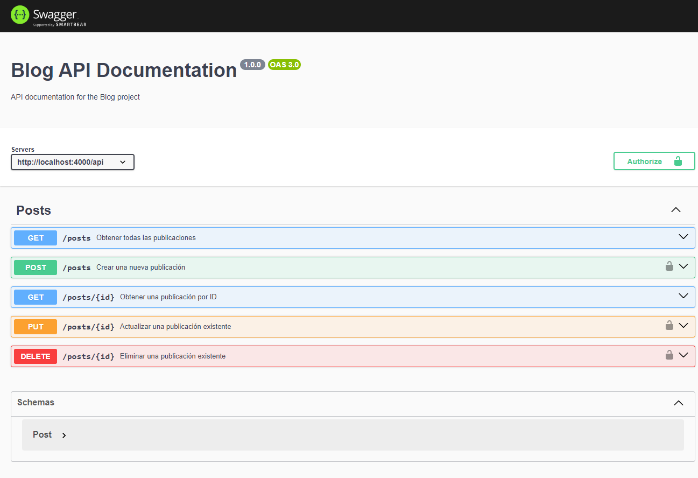

# Project Summary

**Express Blog application project**: This project focuses on creating a Backend server that interacts with the MongoBD Database and sends data through an API to the React Blog application using ExpressJs, it is structured in modules for its better scalability

# Project Objectives

The project follows **three learning objectives**:

1. How to create APIs to Create, Read, Update and Delete Posts.
2. How to validate and authenticate users with Tokens using JWT to validate the editing and creation of publications, through FrontEnd client requests.
3. Document API routes using Swagger

# Requirements

Have knowledge of Javascript, Express Js, APIs, understanding, and use of the Swagger library.

# Technical Requirements

- Node Js
- Express Js
- Axios
- Jwt
- Swagger

# Preview

### Swagger Docs Screen 

***
